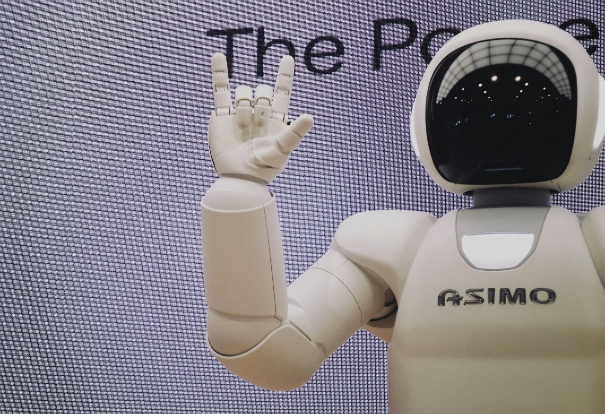

# Portfolio-Project

<!DOCTYPE html>
<html lang="en">
<head>
  <meta charset="UTF-8" />
  <meta name="viewport" content="width=device-width, initial-scale=1.0"/>
  <title>Parth Deshmukh - Portfolio</title>
  
</head>
<body>
  <nav>
    
Parth Deshmukh

    

      <ul class="nav-links">
        <li><a href="#home">Home</a></li>
        <li><a href="#about">About</a></li>
        <li><a href="#projects">Projects</a></li>
        <li><a href="#skills">Skills</a></li>
        <li><a href="#certifications">Certifications</a></li>
        <li><a href="#interests">Interests</a></li>
        <li><a href="#contact">Contact</a></li>
      </ul>
      <button class="theme-toggle">🌙</button>
    

  </nav>

  <section class="hero" id="home">
    <h2 class="greeting">Hi I'm</h2>
    

      
Parth Deshmukh

      

    

    
Aspiring Full-Stack Developer & Machine Learning Enthusiast

    <h1>Turning data into insights and ideas into reality through intelligent code</h1>
    <button>Explore More</button>
  </section>

  <section class="bio" id="about">
    <h2>About Me</h2>
    

      

        
      

      

        

          Hi, I'm Parth — a first-year B.Tech student in the IT branch with a strong passion for computer applications and technology.  
          I'm driven by curiosity, always eager to learn, and committed to giving 100% to every project I take on.  
          Whether it's coding, building systems, or exploring new tools, I’m excited to grow my skills and contribute meaningfully to the world of tech.
        

      

    

  </section>

  <section class="projects" id="projects">
    

      <h2>Student Management System</h2>
      
<strong>Tech Stack:</strong> C, Oracle Database

      
A console-based app to manage student records: enrollment, grades, attendance.

      <ul>
        <li>Add, update, delete records</li>
        <li>Attendance tracking</li>
        <li>Grade calculation</li>
        <li>Secure login for admin/teachers</li>
      </ul>
    

    

      <h2>Library Management System</h2>
      
<strong>Tech Stack:</strong> C, Oracle Database

      
System to manage books, student memberships, and issue/return logs.

      <ul>
        <li>Book search and categorization</li>
        <li>Fine calculation</li>
        <li>Admin dashboard with reports</li>
      </ul>
    

    

      <h2>Expense Tracker</h2>
      
<strong>Tech Stack:</strong> C, Oracle Database

      
CLI tool for tracking daily expenses and monthly analysis.

      <ul>
        <li>Expense categorization</li>
        <li>Spending analysis</li>
        <li>Data encryption</li>
      </ul>
    

  </section>

  <section id="skills">
    <h2>Skills</h2>

    

      <h4> Programming Languages</h4>
      

        
        
        
        
        
        
      

    

    

      <h4> Software Tools</h4>
      

        
        
        
        
      

    

    

      <h4>🧠 Soft Skills</h4>
      

        Teamwork
        Problem Solving
        Communication
        Time Management
        Leadership
      

    

    

      <h4> Web Development</h4>
      

        
        
        
        
      

    

  </section>

  <section id="certifications">
    <h2>Certifications</h2>
    

      

        <h3>Oracle SQL</h3>
        
Completed via Great Learning Academy – December 2024

        <a href="Parth%20rajesh%20deshmukh.pdf" target="_blank" class="cert-btn">View Certificate</a>
      

      

        <h3>AI Workshop</h3>
        
Workshop on Exploring AI for the Next-Gen Engineer – April 12, 2025

        <a href="Exploring%20AI%20Workshop%20Certificate.pdf" target="_blank" class="cert-btn">View Certificate</a>
      

      

        <h3>Python Essentials 1</h3>
        
Completed via MIT Academy of Engineering, Alandi Pune through Cisco Networking Academy – 08 Apr 2025

        <a href="_certificate_202401080071-mitaoe-ac-in_a328a69c-3e98-452d-8d27-1fa4d301065f.pdf" target="_blank" class="cert-btn">View Certificate</a>
      

      

        <h3>Python Essentials 2</h3>
        
Completed via Networking Academy through the Cisco Networking Academy program – 27 Mar 2025

        <a href="_certificate_202401080071-mitaoe-ac-in_fb8437d1-6050-47c9-9bfb-d2194717754e.pdf" target="_blank" class="cert-btn">View Certificate</a>
      

    

  </section>

  <section id="interests">
    <h2>My Interests</h2>
    

      

        
        
Space Exploration

      

      

        
        
Code Development

      

      

        
        
Machine Learning

      

      

        
        
Technology Innovation

      

    

  </section>

  <section class="contact-form" id="contact">
    <h2>Contact Me</h2>
    <form>
      <input type="text" placeholder="Your Name" required />
      <input type="email" placeholder="Your Email" required />
      <textarea placeholder="Your Message" rows="5" required></textarea>
      <button type="submit">Send</button>
    </form>
  </section>

  <footer>
    
© 2025 Parth Deshmukh. All rights reserved.

  </footer>

  
</body>
</html>
